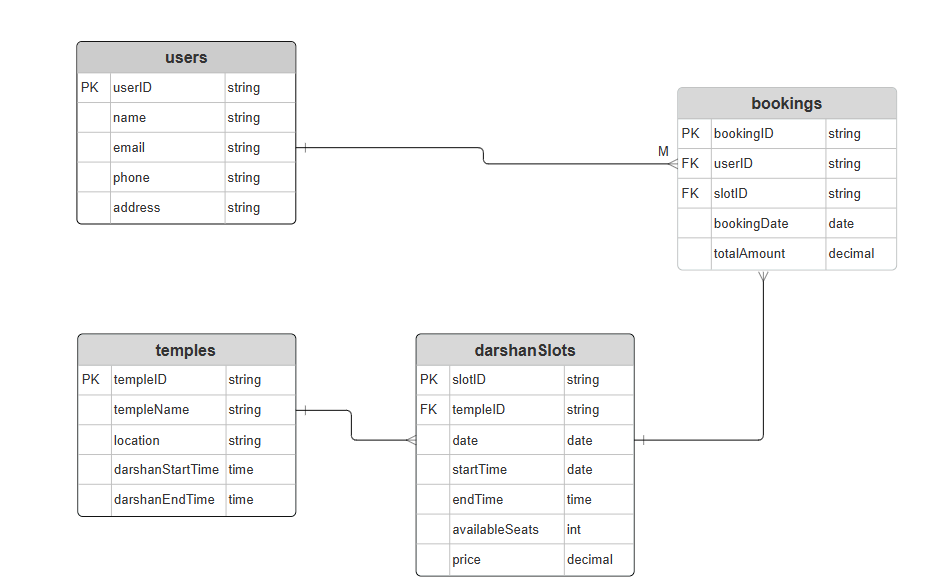
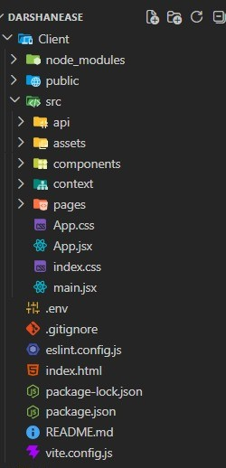
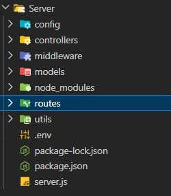
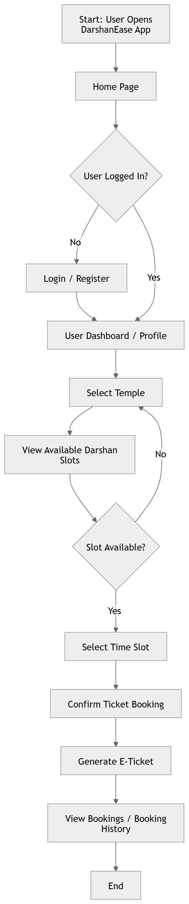

# Table of Contents

1. About the Project
2. Tech Stack
3. Features
4. System Architecture
5. Database Implementation
6. Frontend Implementation
7. Backend Implementation
8. MVC Architecture
9. Authentication & Authorization
10. Roles & Responsibilities
11. User Flow
12. API Endpoints
13. Getting Started
14. Future Improvements

## 1. About the Project
DarshanEase is a full-stack web application that simplifies temple visit management by allowing devotees to book their darshan slots in advance — reducing crowd congestion and improving the overall temple visit experience.

**Problem It Solves**
Long queues and overcrowding at popular temples
No structured system for managing darshan timings
Lack of digital booking and confirmation for devotees

**Solution**
DarshanEase provides a structured digital booking platform where devotees can browse temples, check real-time slot availability, and book their visit in advance — all from a single web application.

## 2. Tech Stack
Frontend - React.js, HTML, CSS, JavaScript
Backend - Node.js, Express.js
Database - MongoDB, Mongoose ODM
Authentication - JWT (JSON Web Tokens), bcrypt
API Communication - Axios (REST API)
State Management - React Context API
Routing - React Router

## 3. Features

### Authentication & User Management
- Secure devotee registration and login
- Role-based authentication (Devotee, Organizer, Admin)
- JWT-based stateless authentication
- Profile management and booking history

### Temple & Darshan Management
- Comprehensive temple directory with detailed listings
- Dynamic creation and management of darshan slots
- Real-time slot availability tracking
- Configurable capacity limits per slot

### Ticket Booking System
- Seamless darshan slot selection
- Multi-devotee booking support
- Overbooking prevention with validation
- Instant booking confirmation with unique Booking ID

### Donations
- Support for online donations along with ticket booking
- Transaction validation and confirmation tracking

### Dashboards
- **Organizer Dashboard** – Manage slots, track bookings, monitor capacity
- **Admin Dashboard** – Full system control, user management, temple oversight

## 4. System Architecture
DarshanEase follows a **three-tier MERN architecture** with clear separation of concerns.

Client (Browser)
      ↓
React.js Frontend
      ↓  (REST API via Axios)
Express.js Server (Node.js)
      ↓
Authentication & Role Middleware
      ↓
MongoDB Database (Mongoose ODM)

### Architectural Patterns Used
- **MVC** – Model–View–Controller pattern
- **RESTful API** – Standard HTTP methods and status codes
- **RBAC** – Role-Based Access Control
- **Modular Structure** – Independent feature modules

## 5. Database Implementation
The application uses MongoDB with Mongoose ODM for schema modeling.

### Collections
**users**- Authentication, role, and profile information
**temples**- Temple details and organizer reference
**darshan** - SlotsSlot timings, capacity, andavailability
**bookings** - User-slot relationship and booking records

### Schemas

**1. User**
js
{
  username: String (required, trim)
  email:    String (required, unique, lowercase)
  password: String (required, bcrypt hashed)
  role:     String (enum: 'user', 'organizer', 'admin', default: 'user')
  timestamps: true
}

**2. Temple**
js
{
  name:        String (required)
  location:    String (required)
  description: String
  image:       String (URL)
  organizer:   ObjectId (ref: User)
  timestamps: true
}

**3. Slot (Darshan)**
js
{
  temple:       ObjectId (ref: Temple)
  name:         String (required)
  open:         String (opening time e.g. "06:00 AM")
  close:        String (closing time e.g. "12:00 PM")
  normalDarshan: Number (price)
  vipDarshan:   Number (price)
  description:  String
  timestamps: true
}

**4. Booking**
js
{
  user:        ObjectId (ref: User)
  temple:      ObjectId (ref: Temple)
  slot:        ObjectId (ref: Slot)
  bookingDate: Date
  darshnaName: String
  noOfSlots:   Number
  type:        String (enum: 'Normal', 'VIP', default: 'Normal')
  status:      String (enum: 'Confirmed', 'Cancelled', default: 'Confirmed')
  timestamps: true
}

### Relationships
- One User can have many Bookings
- Each Booking is linked to one DarshanSlot
- Each DarshanSlot belongs to one Temple

### ER Diagram

**Indexing Strategy**
Indexes are applied on frequently queried fields for better performance:
userId – for fetching user bookings
templeId – for fetching temple slots
slotId – for booking validation

## 6. Frontend Implementation
The frontend is built using React.js with a component-based architecture.

### Folder Structure

### Component Structure
- components/ - Reusable UI elements (Navbar, Cards, Buttons)
- pages/ - Full page views (Home, Login, Booking, Dashboard)
- context/ - Global authentication state
- api/ - Centralized Axios API call functions

### Routing
React Router is used for client-side navigation.

- Public Routes – Home, Login, Register, Temple Listing
- Protected Routes – Dashboard, Booking, Profile (requires login)
- Role-Based Routes – Admin Panel, Organizer Dashboard (requires role)

### State Management
React Context API is used for managing global authentication state:

- Stores logged-in user info and JWT token
- Provides auth state to all components
- Handles login/logout actions globally

### API Integration
Axios is used for all API communication:

- Base URL configured centrally
- JWT token automatically attached to request headers
- Centralized error handling for API responses

## 7. Backend Implementation
The backend is built using Node.js and Express.js following the MVC pattern.1

### Folder Structure

### Core Modules

- Authentication - Register, Login, JWT generation
- Temple Management - Temple CRUD operations
- Slot Management - Create and manage darshan slots
- Booking - Booking creation and cancellation
- Donation - Donation processing
- Admin - User and system management

### Request Processing Flow
Route → Middleware → Controller → Model → Database → Response

### Error Handling
The system returns structured error responses with standard HTTP status codes:
- 400 - Bad Request
- 401 - Unauthorized
- 403 - Forbidden
- 404 - Resource Not Found
- 500 - Internal Server Error

## 8. MVC Architecture

The DarshanEase backend application follows the **Model–View–Controller (MVC)** architectural pattern.  
MVC separates an application into three interconnected layers, making the system easier to maintain, scale, and understand.

### 1. Model Layer (Data Layer)
The Model layer manages all data-related logic. It defines the structure of the application's data and interacts with the database.
In this project, models are implemented using Mongoose, which provides a schema-based solution for working with MongoDB.

Responsibilities of the Model layer:
- Define database schemas
- Perform database operations (create, read, update, delete)
- Handle data validation
- Communicate directly with MongoDB

### 2. Controller Layer
The Controller layer acts as the bridge between the routes and the models.
It processes incoming requests, performs necessary validations, interacts with the models, and returns responses to the client.

Responsibilities of the Controller layer:
- Receive HTTP requests
- Process request data
- Call appropriate model functions
- Send responses back to the client

### 3. View Layer (Routing Layer)
In a backend REST API, the view layer is represented by the **routing system**.
Routes define the available API endpoints and determine which controller function should handle each request.

Responsibilities of the View (Routing) layer:
- Define API endpoints
- Handle HTTP methods (GET, POST, PUT, DELETE)
- Connect requests to the appropriate controller

### Advantages of Using MVC in This Project

- Separation of Concerns
  Each layer has a clear responsibility, improving code readability and maintainability.

- **Scalability**  
  New features can be added by creating new models, controllers, and routes.

- **Reusability**  
  Business logic written in controllers and models can be reused across the application.

- **Testing**  
  Controllers and models can be tested independently.

- **Collaboration-Friendly**  
  Multiple developers can work on different layers simultaneously without conflicts.

## 9. Authentication & Authorization

### Authentication Flow
1. User submits credentials (email + password)
2. Password verified using bcrypt
3. JWT token generated on success
4. Token returned to client
5. Client attaches token in request header for all protected routes

### Role-Based Access Control (RBAC)
- USER - Book slots, view bookings, manage profile
- ORGANIZER - Manage temple slots, view bookings
- ADMIN - Full system access

Middleware validates:
- Token authenticity
- User role
- Route access permission

##  10. Roles & Responsibilities

### Devotee (User)
- Register and login securely
- Browse temples and available darshan slots
- Book slots and receive e-tickets
- View and manage booking history
- Submit ratings and feedback

### Organizer

- Manage temple profile
- Create, update, and delete darshan slots
- Configure slot capacity and timings
- View and manage devotee bookings
- Receive booking notifications

### Administrator
- Full platform governance and control
- Manage devotee and organizer accounts
- Approve temple registrations
- Oversee all bookings and slot scheduling
- Enforce security and compliance

## 11. User Flow

## 12. API Endpoints
Here are all the API endpoints used in DarashanEase:

*AUTH* — /api/auth
- POST /api/auth/register — Register new user
- POST /api/auth/login — Login
- GET /api/auth/me — Get logged in user info

*TEMPLES* — /api/temples
- GET /api/temples — Get all temples (public)
- GET /api/temples/:id — Get single temple + slots (public)
- GET /api/temples/my — Get organizer's own temple
- POST /api/temples — Create temple (organizer)
- PUT /api/temples/:id — Update temple (organizer)
- DELETE /api/temples/:id — Delete temple (admin)

*SLOTS/DARSHANS* — /api/slots
- GET /api/slots/temple/:templeId — Get slots for a temple (public)
- GET /api/slots/my — Get organizer's own slots
- POST /api/slots — Create slot (organizer)
- PUT /api/slots/:id — Update slot (organizer)
- DELETE /api/slots/:id — Delete slot (organizer/admin)

*BOOKINGS* — /api/bookings
- POST /api/bookings — Create booking (user)
- GET /api/bookings/my — Get user's bookings
- GET /api/bookings/organizer — Get organizer's temple bookings
- PUT /api/bookings/:id/cancel — Cancel booking

*ADMIN* — /api/admin
- GET /api/admin/dashboard — Get stats (users, organizers, temples, darshans, bookings)
- GET /api/admin/users — Get all users
- GET /api/admin/organizers — Get all organizers
- GET /api/admin/temples — Get all temples
- GET /api/admin/bookings — Get all bookings
- DELETE /api/admin/users/:id — Delete a user

## 13. Getting Started
### Prerequisites
Make sure you have the following installed:
- Node.js (v18 or higher)
- MongoDB (local or Atlas)
- Git

### Installation
1. **Clone the repository**
git clone https://github.com/saloni/darshanease.git
cd darshanease

2. **Install backend dependencies**
cd server
npm install

3. **Install frontend dependencies**
cd ../client
npm install

4. **Run the backend server**
cd server
npm start

5. **Run the frontend**
cd client
npm run dev

The frontend will run on http://localhost:5173 and the backend on http://localhost:5000.

## 14. Future Improvements
- Online payment gateway integration
- Email notifications for booking confirmation
- Mobile application (React Native)
- Real-time slot updates using WebSockets
- Advanced analytics and reporting dashboard
- Multi-language support
